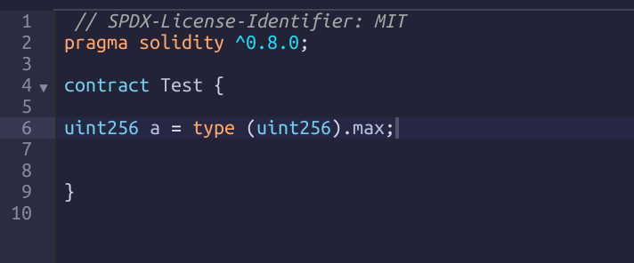
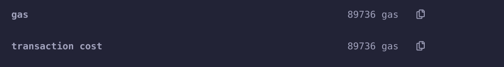
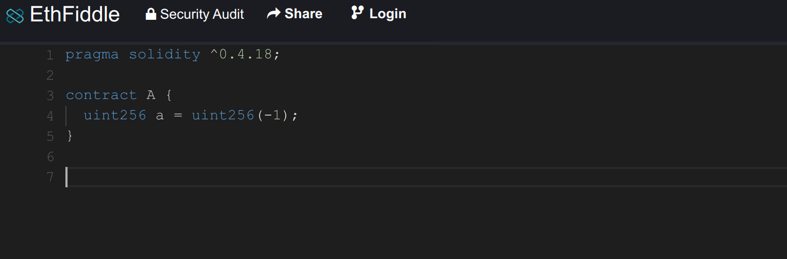
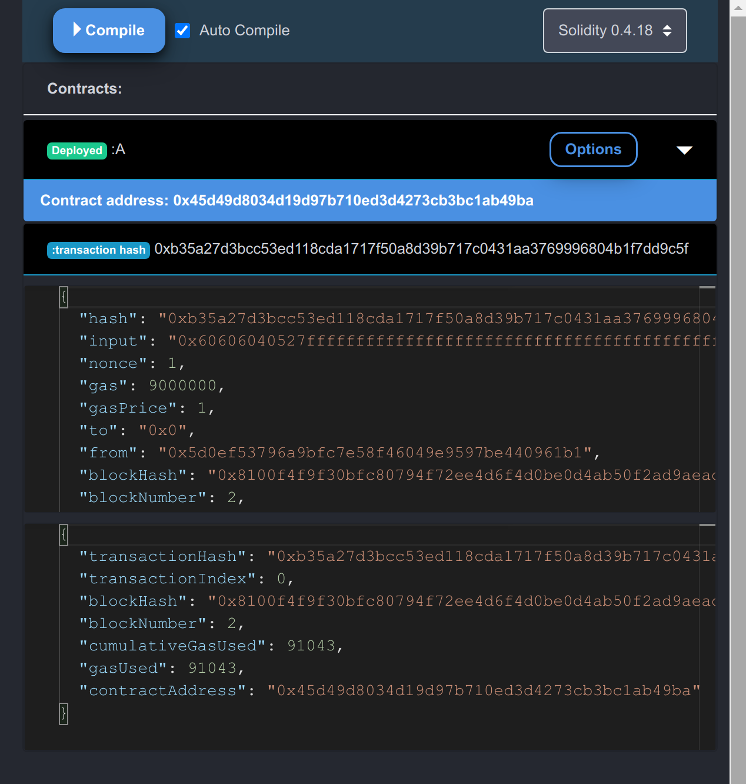
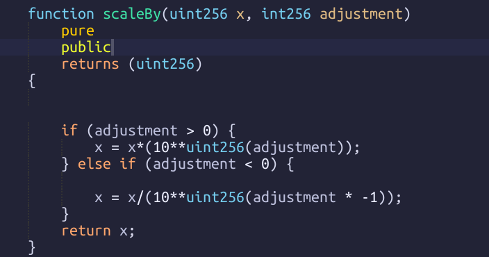
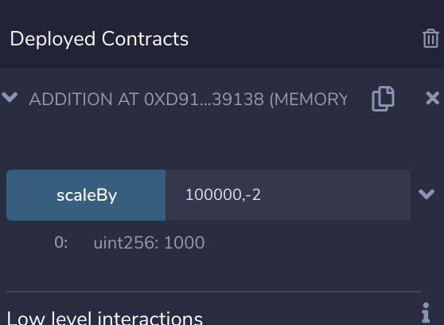
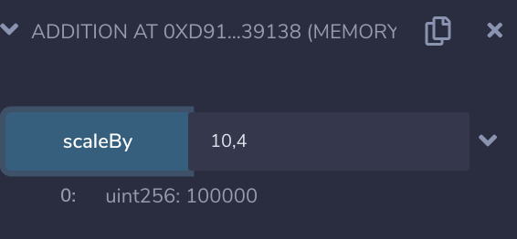

  # 1. Introduction
  this Repport is a part of Sperax hackaton challenge 2 which consists to find any implementation issues and try to fix it regarding to the white-paper included as a material.
  
  **Here Is The Table of contents:**
  - [1. Introduction](#1-introduction)
  - [1.1. Background:](#11-background)
- [1. Introduction](#1-introduction)
  - [1.1. Background](#11-background)
- [2. Implementation Issues](#2-implementation-issues)
  - [2.1. Warnings:](#21-warnings)
    - [2.1.1. SPDX License:](#211-spdx-license)
    - [2.1.2. Unused Local Variables](#212-unused-local-variables)
    - [2.1.3. Unnamed return variable:](#213-unnamed-return-variable)
  - [2.2. Errors:](#22-errors)
    - [2.2.1. Dependencies import Errors:](#221-dependencies-import-errors)
    - [2.2.2. Declaration error:](#222-declaration-error)
    - [2.2.3. Forbidden uint(-1) type:](#223-forbidden-uint-1-type)
    - [2.2.4. Duplicate declarations:](#224-duplicate-declarations)
    - [2.2.5. Unknown ERC20Upgradable method:](#225-unknown-erc20upgradable-method)
    - [2.2.6. Duplicated Declared modifier:](#226-duplicated-declared-modifier)
    - [2.2.7 deprecated now method:](#227-deprecated-now-method)
    - [2.2.8. Unary operator](#228-unary-operator)
  - [2.2.9. Adjustement function:](#229-adjustement-function)
- [3. Implementation Fixes:](#3-implementation-fixes)
  - [3.1. Warnings:](#31-warnings)
    - [3.1.1. SPDX License:](#311-spdx-license)
    - [3.1.2. Unused Local Variables:](#312-unused-local-variables)
    - [3.1.3. Unnamed return variable:](#313-unnamed-return-variable)
  - [3.2. Errors:](#32-errors)
    - [3.2.1. Dependencies import Errors:](#321-dependencies-import-errors)
    - [3.2.2. Declaration error:](#322-declaration-error)
    - [3.2.3. Forbidden uint(-1) type:](#323-forbidden-uint-1-type)
    - [3.2.4. Duplicate declarations:](#324-duplicate-declarations)
    - [3.2.5. Unknown ERC20Upgradable method:](#325-unknown-erc20upgradable-method)
    - [3.2.6. Duplicated Declared modifier:](#326-duplicated-declared-modifier)
    - [3.2.7 deprecated now method:](#327-deprecated-now-method)
    - [3.2.8. Unary operator](#328-unary-operator)
  - [3.2.9. Adjustement function:](#329-adjustement-function)
- [4. Sources:](#4-sources)

  ## 1.1. Background
  the implementation was tested using the following dependencies:
 
  |             dependency              |                 Version                  |
  | :---------------------------------: | :--------------------------------------: |
  |       @openzepplin/contracts        |              Version: 4.3.0              |
  | @openzeppelin/contracts-upgradeable |              Version: 4.3.0              |
  |          Solidity Compiler          | Version: 0.8.0+commit.c7dfd78e.Linux.g++ |
  |               Truffle               |              Version: 5.4.0              |
  |               Node.js               |             Version: 14.17.4             |
  |                 npm                 |             Version: 7.20.5              |
  
 In order to update the contracts implementations with new dependencies versions, the fixes will be based on above dependencies versions.

 you can find the fixed version on this  [link](https://github.com/bayou020/USDs-Gitcoin/)

all code modifications were commited into this [link](https://github.com/bayou020/USDs-Gitcoin/commit/a1957982ee2c6e61596842f277b9fb4ab1641bf5#diff-0194acfe55095df794a50ab963ef69609651c5e807c4a75c6dd4ec1590310889L297)
  # 2. Implementation Issues
  ## 2.1. Warnings:
  ### 2.1.1. SPDX License:
  those low level warnings includes the SPDX license include as follows: 
  ```
  SPDX license identifier not provided in source file. Before publishing, consider adding a comment containing "SPDX-License-Identifier: <SPDX-License>" to each source file. Use "SPDX-License-Identifier: UNLICENSED" for non-open-source code. Please see https://spdx.org for more information.
  ```
  this warning was found on all files.

  here is the [fix](#311-spdx-license)

### 2.1.2. Unused Local Variables
 on the file `contracts/oracle/oracle.sol` There was a lot of unused local variables as follows:
 
 (xxx) is used to pin the unused variable.
 `line 214`
 ```javascript
function getETHPrice() public view override returns (uint) {
		(
		xxx	uint80 roundID,
			int price,
		xxx	uint startedAt,
		xxx	uint timeStamp,
		xxx	uint80 answeredInRound
		) = priceFeedETH.latestRoundData();
		return uint(price);
	}


 ```
 `line 224`
 
 ```javascript
 function getAssetPrice(address assetAddress) public view override returns (uint) {
		(
		xxx	uint80 roundID,
			int price,
		xxx	uint startedAt,
		xxx	uint timeStamp,
		xxx	uint80 answeredInRound
		) = priceFeeds[assetAddress].latestRoundData();
		return uint(price);
	}

 ```
 `line 239`
```javascript
 	function getSPAPrice() external view override returns (uint) {
		uint ETHPrice = getETHPrice();

    xxx uint token0PriceMA_NoPrec = token0PriceMA.div(2**112);
        //failing case: 1 ETH > 10^25 SPA or token0PriceMA/2**112 < ETHPrice
        return ETHPrice.mul(2**112).div(token0PriceMA);
	}
```
`line 324`
```javascript
  xxx  uint USDsInflowOneDay = USDsInflow[indexNew].sub(USDsInflow[indexOld]);
```
 ` contracts/strategies/AaveStrategy.sol`
`Line 141`

 the `_aToken` variable was unused here inside the function `_abstractSetPToken`
 ```javascript
  function _abstractSetPToken(address _asset, address _aToken) internal override {
        address lendingPoolVault = _getLendingPoolCore();
        ERC20Upgradeable(_asset).safeApprove(lendingPoolVault, 0);
        ERC20Upgradeable(_asset).safeApprove(lendingPoolVault, uint256(-1));

```
here is the [fix](#312-unused-local-variables)

### 2.1.3. Unnamed return variable:

`contracts/libraries/BancorFormula.sol`

*Line 280* the function *findPositionInMaxExpArray* the *return* variable was unnamed as follows:
```
function findPositionInMaxExpArray(uint256 _x) internal view returns (uint8)
```
which leads to this warning:
```
Unnamed return variable can remain unassigned. Add an explicit return with value to all non-reverting code paths or name the variable.
```

Here is the **[fix](#313-unnamed-return-variable)**
## 2.2. Errors:
### 2.2.1. Dependencies import Errors:
Since we use the last version of OpenZepplin contracts library few dependencies path were changed as follows:

`"@openzeppelin/contracts-upgradeable/math/SafeMathUpgradeable.sol";`

**import error found on those files:**
```
contracts/libraries/BancorFormula.sol
contracts/libraries/StableMath.sol
contracts/oracle/Oracle.sol
contracts/strategies/InitializableAbstractStrategy.sol
contracts/token/USDs.sol 
contracts/vault/VaultCore.sol
```
`"@openzeppelin/contracts-upgradeable/token/ERC20/SafeERC20Upgradeable.sol"`

**import error found on those files**

```
contracts/strategies/InitializableAbstractStrategy.sol
contracts/vault/VaultCore.sol 
```

`"@openzeppelin/contracts-upgradeable/proxy/Initializable.sol"`

**import error found on those files**

```
contracts/vault/VaultStorage.sol
contracts/vault/VaultCore.sol
contracts/token/USDs.sol
contracts/strategies/InitializableAbstractStrategy.sol
contracts/oracle/Oracle.sol 
```
here is the [fix](#321-dependencies-import-errors)
### 2.2.2. Declaration error:
in the file `Governable.sol` on the `Line 42` there was an error in the declaration of a constructor
```javascript
  constructor() internal  {
        _setGovernor(msg.sender);
        emit GovernorshipTransferred(address(0), _governor());
    }
```
which landed to this error 
```
DeclarationError: Non-abstract contracts cannot have internal constructors. Remove the "internal" keyword and make the contract abstract to fix this.
--> contracts/governable.sol:42:5:

```
here is the [fix](#322-declaration-error)
### 2.2.3. Forbidden uint(-1) type:
this error is due to the decapation of solidity compiler for using it as a casting for a `MAX_VALUE` [2](https://docs.soliditylang.org/en/v0.8.0/080-breaking-changes.html) on **New restrictions section**

this error was found on those files
```
contracts/libraries/BitMath.sol Lines: 48,53,58,63,68
```
```
contracts/libraries/FixedPoint.sol

Lines: 81, 87, 98,100,105,115,117,121,138

```
```
contracts/libraries/FullMath.sol
Line: 8
```
```
contracts/strategies/AaveStrategy.sol
Line:131,144
```
Here is the [fix](#323-forbidden-uint-1-type)

### 2.2.4. Duplicate declarations:
In `VaultCore.sol` contract on the lines *527* and *535* the variable 
*totalValueLocked* was declared as an *uint* and as a *function* which leads the compiler to output the following error :

```
,Warning: This declaration has the same name as another declaration.
   --> project:/contracts/vault/VaultCore.sol:527:9:
    uint totalValueLocked = _totalValueLocked();
  
Note: The other declaration is here:
   --> project:/contracts/vault/VaultCore.sol:535:5:
    |
535 |     function totalValueLocked() external view returns (uint value) {
    |     ^ (Relevant source part starts here and spans across multiple lines).
   ```
   ### 2.2.5. Unknown ERC20Upgradable method:

   in `contracts/strategies/AaveStrategy.sol`  *line 73,88,142,143*
   ```solidity
73 ERC20Upgradeable(_asset).safeTransfer(_recipient, _amount);
142 ERC20Upgradeable(asset).safeApprove(lendingPoolVault, 0);
143  ERC20Upgradeable(asset).safeApprove(lendingPoolVault, type(uint256).max);
```
`safeTransfer` and `safeApprove` methods are not known by `ERC20Upgradeable` library which they are methods of `safeERC20Upgradeable` library

Here is the **[fix](#325-unknown-erc20upgradable-method)**

### 2.2.6. Duplicated Declared modifier:
`contracts/oracle/oracle.sol`
the modifier `update` was declared multiple times on:
```
event Update(uint currPriceMA, uint currPricetime);
emit Update(token0PriceMA, price0Cumulative);
 ```
Here is the **[fix](#326-duplicated-declared-modifier)**
### 2.2.7 deprecated now method:

On *Solidity 0.8.0* `now` is not used anymore:
found on: `contracts/oracle/Oracle.sol`
in *Lines 123,295*
```javascript
uint32 constructTime = uint32(now % 2 ** 32);
uint32 currTime = uint32(now % 2 ** 32);
```
### 2.2.8. Unary operator
in `contracts/libraries/FullMath.sol` *Line 19,22*
```
uint256 pow2 = d & -d;
l += h * ((-pow2) / pow2 + 1);
```
shows an error:
```
Unary operator - cannot be applied to type uint256
```
Here is the **[fix](#328-unary-operator)**

## 2.2.9. Adjustement function:

in `contracts/libraries/StableMath.sol` 
``` 
function scaleBy(uint256 x, int8 adjustment)
```
returns an `uint256` value
which returns an error as follows:
```
Explicit type conversion not allowed from "int8" to "uint256".
```
here is the **[fix](#329-adjustement-function)**

# 3. Implementation Fixes:
## 3.1. Warnings:
  ### 3.1.1. SPDX License:
  just add the appropriate license in line 1 of the contract:
  ```
  // SPDX-License-Identifier: <LICENSE_TYPE>
  ```
### 3.1.2. Unused Local Variables:
 `oracle.sol`

The unused local variables will take more gas for executing the (op) code based on the datatype
So if there is a need to use them later just change the state by pushing these variables to some kind of array or mapping. if not just delete them it will take less gas during the operations.[1](https://ethereum.stackexchange.com/questions/38420/compile-error-warning-unused-local-variable)

 ` contracts/strategies/AaveStrategy.sol` `Line 153`

 Replaced `lendingPoolVault` variable with `_aToken`

 ```javascript
    //Fixed unused _aToken Variable by deleting lendingPoolVault variable and assigning it to _aToken one for approval
    function _abstractSetPToken(address _asset, address _aToken) 
        internal
        override
    {
        _aToken = _getLendingPoolCore();
        ERC20Upgradeable(_asset).safeApprove(_aToken, 0);
        ERC20Upgradeable(_asset).safeApprove(_aToken, type(uint256).max); 
```
### 3.1.3. Unnamed return variable:

the fix consists to add a variable *value* to the return variable.

it will be:
```javascript
 function findPositionInMaxExpArray(uint256 _x) internal view returns (uint8 value)
 ```
 Can have further advantages in term of gas cost simply using named return values as temporary local variable. [3](https://ethereum.stackexchange.com/questions/67708/should-i-give-names-to-return-values-when-a-function-returns-several-of-them/67711)

## 3.2. Errors:
### 3.2.1. Dependencies import Errors:
The above Errors were fixed by changing dependency path as follow:

`"@openzeppelin/contracts-upgradeable/utils/math/SafeMathUpgradeable.sol";`

```
contracts/libraries/BancorFormula.sol
contracts/libraries/StableMath.sol
contracts/oracle/Oracle.sol
contracts/strategies/InitializableAbstractStrategy.sol
contracts/token/USDs.sol 
contracts/vault/VaultCore.sol
```
`"@openzeppelin/contracts-upgradeable/token/ERC20/utils/SafeERC20Upgradeable.sol"`

```
contracts/strategies/InitializableAbstractStrategy.sol
contracts/vault/VaultCore.sol 
```

`"@openzeppelin/contracts-upgradeable/proxy/utils/Initializable.sol"`

```
contracts/vault/VaultStorage.sol
contracts/vault/VaultCore.sol
contracts/token/USDs.sol
contracts/strategies/InitializableAbstractStrategy.sol
contracts/oracle/Oracle.sol 
```
### 3.2.2. Declaration error:

The fix consists to remove the modifier `internal` from the constructor as follows

```javascript
 constructor()  {
        _setGovernor(msg.sender);
        emit GovernorshipTransferred(address(0), _governor());
    }

```
### 3.2.3. Forbidden uint(-1) type:

To fix this issue, and get the maximum value of an integer we can proceed into different approaches like mentionned **[here](https://forum.openzeppelin.com/t/using-the-maximum-integer-in-solidity/3000)**
but all those methods are more *gas* consuming and the best method to get the maximum value and spending less gas is `type(uintX).max` where *X* is the number of bits from 2^3=8 till  2^8=256

after testing the new method on:

1- *Remix IDE* using *solidity compiler* version *0.8.0* we got:




The *used gas* value is *89736*

2 [ethfiddle](https://ethfiddle.com/) using *solidity compiler* version *0.4.18* we got:


The *used gas* value is *91043*

### 3.2.4. Duplicate declarations:

we can just modify the name of one of those variables for my case, i've changed the function duplicated variable for `total_Value_Locked()` variable

  ### 3.2.5. Unknown ERC20Upgradable method:

In order to fix the above problem, we import the following dependency from *OpenZepplin* library
```javascript
import  "@openzeppelin/contracts-upgradeable/token/ERC20/utils/SafeERC20Upgradeable.sol";
```
and add in the begining of the contract the following line:

```javascript
contract AaveStrategy is InitializableAbstractStrategy {
    using SafeERC20Upgradeable for ERC20Upgradeable; 
```
### 3.2.6. Duplicated Declared modifier:
the fix consists to change the name of the modifier to `updated` it will be more convinient.

### 3.2.7 deprecated now method:
To fix this issue we must replace `now` by `block.timestamp` as included in the official reference of *Solidity* [4](https://docs.soliditylang.org/en/breaking/070-breaking-changes.html?highlight=block.timestamp)

### 3.2.8. Unary operator

According to [5](https://ethereum.stackexchange.com/questions/96642/unary-operator-cannot-be-applied-to-type-uint256)
this error can by fixed by changing the previous form to this one:

```
uint256 pow2 = d & (~d+1);
l += h * ((~pow2+1) / pow2 + 1);
```
## 3.2.9. Adjustement function:

to fix this issue we need to change the variable type of *adjustement* to `int256` to cast it proprely with `uint256` local and return variables. the if we want to cast it to another data type then it must be an `uint` variable.

here are some tests on *Remix IDE* 




  # 4. Sources:
  
1-  https://ethereum.stackexchange.com/questions/38420/compile-error-warning-unused-local-variable

2-  https://docs.soliditylang.org/en/v0.8.0/080-breaking-changes.html

3-  https://ethereum.stackexchange.com/questions/67708/should-i-give-names-to-return-values-when-a-function-returns-several-of-them/67711

4-  https://docs.soliditylang.org/en/breaking/070-breaking-changes.html?highlight=block.timestamp

5-  https://ethereum.stackexchange.com/questions/96642/unary-operator-cannot-be-applied-to-type-uint256

